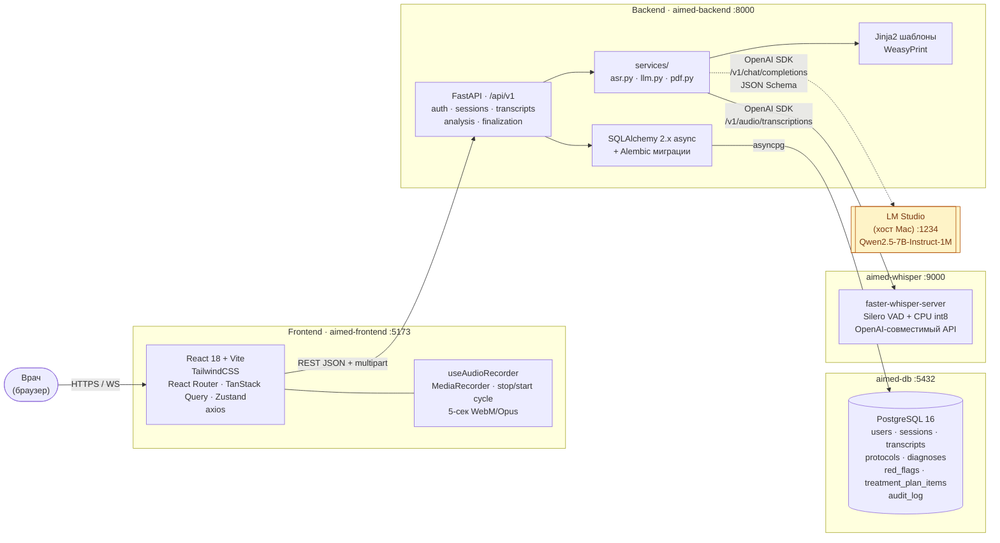
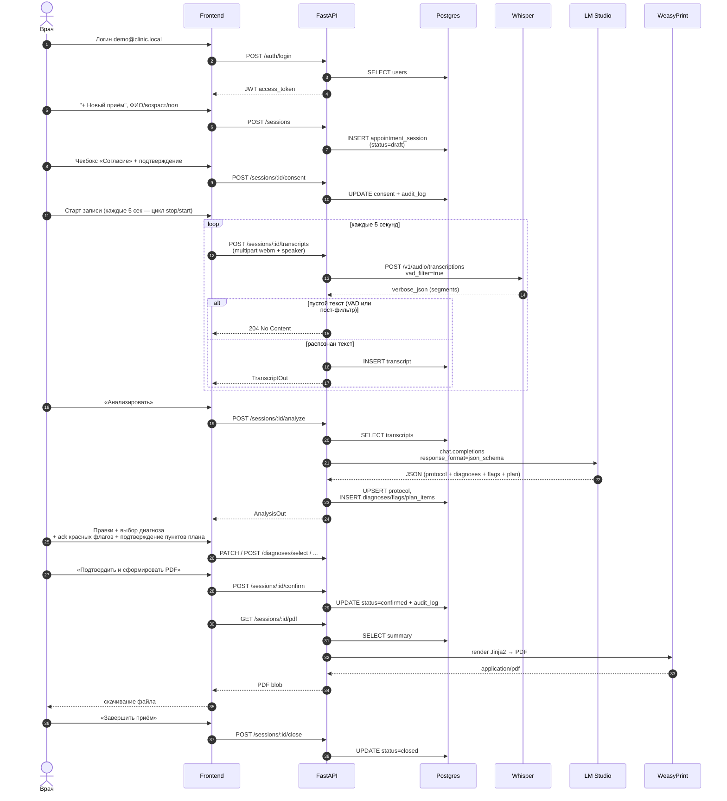
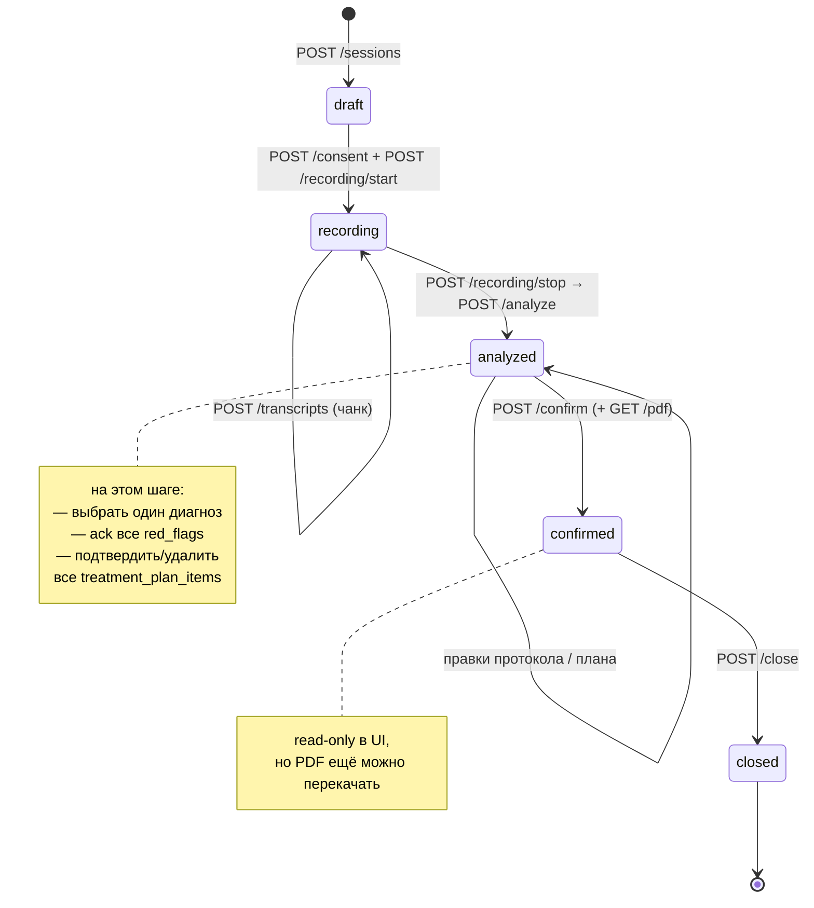
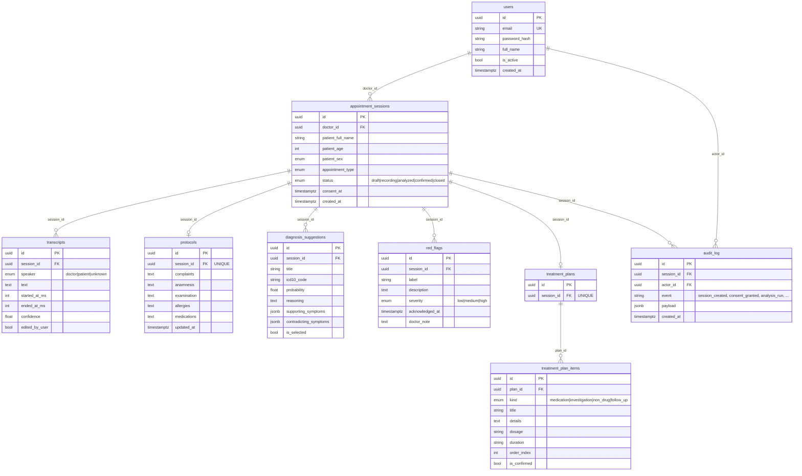
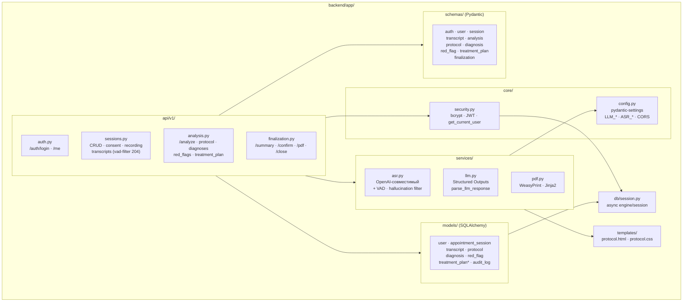
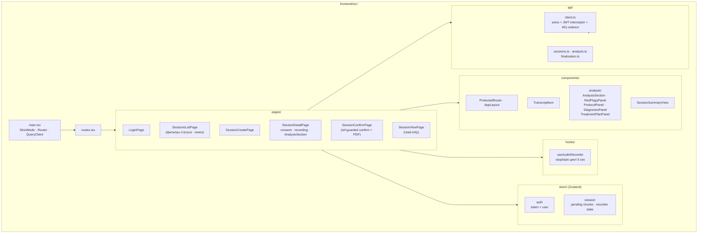

# Архитектура проекта «AI-ассистент врача»

Документ описывает устройство MVP: сервисы, поток данных, схему БД и
модульную структуру. Все диаграммы — в синтаксисе [Mermaid](https://mermaid.js.org/),
они рендерятся в превью Cursor / VSCode и на GitHub без дополнительных
настроек.

---

## 1. Системная архитектура (сервисы и окружение)

Всё, кроме LM Studio, запускается через `docker compose up`. LM Studio
живёт на Mac-хосте, backend-контейнер видит её через
`host.docker.internal` (в `docker-compose.yml` это прописано в
`extra_hosts`).

---

## 2. Жизненный цикл приёма (sequence)

---

## 3. Машина состояний сессии

---

## 4. Схема БД (ER)

---

## 5. Модульная структура backend'а

---

## 6. Модульная структура frontend'а

---

## Ключевые архитектурные решения

1. **Никакого персиста аудио.** Байты чанка живут в памяти backend'а
   только во время вызова Whisper — в БД уходит только распознанный
   текст. После запроса `audio_bytes = b""`.
2. **JWT + middleware 401.** Фронт держит токен в `useAuthStore` +
   `localStorage`; axios-интерсептор на 401 чистит стор и уводит на
   `/login`.
3. **Двухслойная гарантия JSON.** `response_format=json_schema` на
   стороне LLM + `parse_llm_response` с локальной валидацией (границы
   вероятности, `≤3` диагноза, enum-ы, сортировка по убыванию
   probability). Даже если LLM вернёт мусор, до БД он не доедет.
4. **Status-based authorization.** Каждый модифицирующий эндпоинт
   сессий, транскриптов, диагнозов, плана проверяет `session.status` и
   возвращает `409`, если статус уже `confirmed` / `closed`. PDF и
   `/summary` доступны в любом терминальном статусе.
5. **`audit_log` на каждое значимое событие:** `session_created`,
   `consent_granted`, `analysis_run`, `diagnosis_selected`,
   `red_flag_ack`, `protocol_confirmed`, `pdf_generated`,
   `session_closed` — облегчит добавление отчётов, уведомлений и
   интеграций в будущем.
6. **Потоковая расшифровка через цикл stop/start.** Каждые 5 секунд
   фронт делает `MediaRecorder.stop()` + `MediaRecorder.start()` на
   одном и том же `MediaStream`. Так каждый загружаемый WebM —
   самодостаточный файл с EBML-заголовками, который faster-whisper
   умеет декодировать. Если бы использовался timeslice-режим, второй и
   последующие чанки были бы «сырыми» фрагментами без заголовков.
7. **VAD + пост-фильтр галлюцинаций.** На стороне Whisper включён
   Silero-VAD (`vad_filter=true`, `no_speech_threshold=0.6`,
   `temperature=0`), а backend дополнительно проверяет текст на типовые
   артефакты («Субтитры сделал DimaTorzok», «Продолжение следует» и
   пр.). При пустом результате API возвращает `204 No Content`, в БД
   ничего не пишется.
